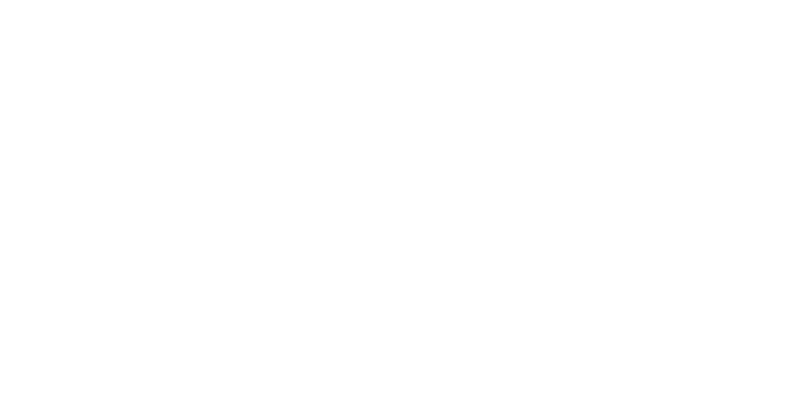

https://github.com/JoseVarelaP/Final-IA/assets/23246027/68095772-cbfe-4d20-b649-b70c6e812c4e

This is a game made in Godot 4 for the final AI project.

Originally this was only going to be a basic 4-opponent chase game, but I really wanted to polish it
to ensure quality post-delivery.

## Controller support?

I want to add controller support, but Godot in MacOS isn't recognizing my Joycons. [Seems to be a common issue too](https://github.com/godotengine/godot/issues/44840).
